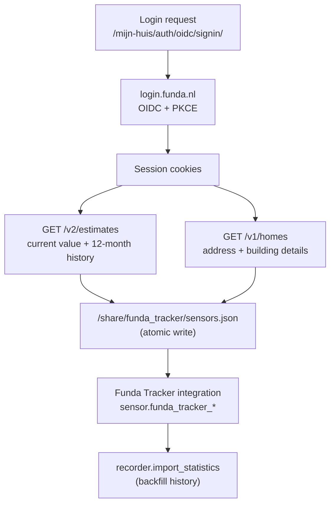
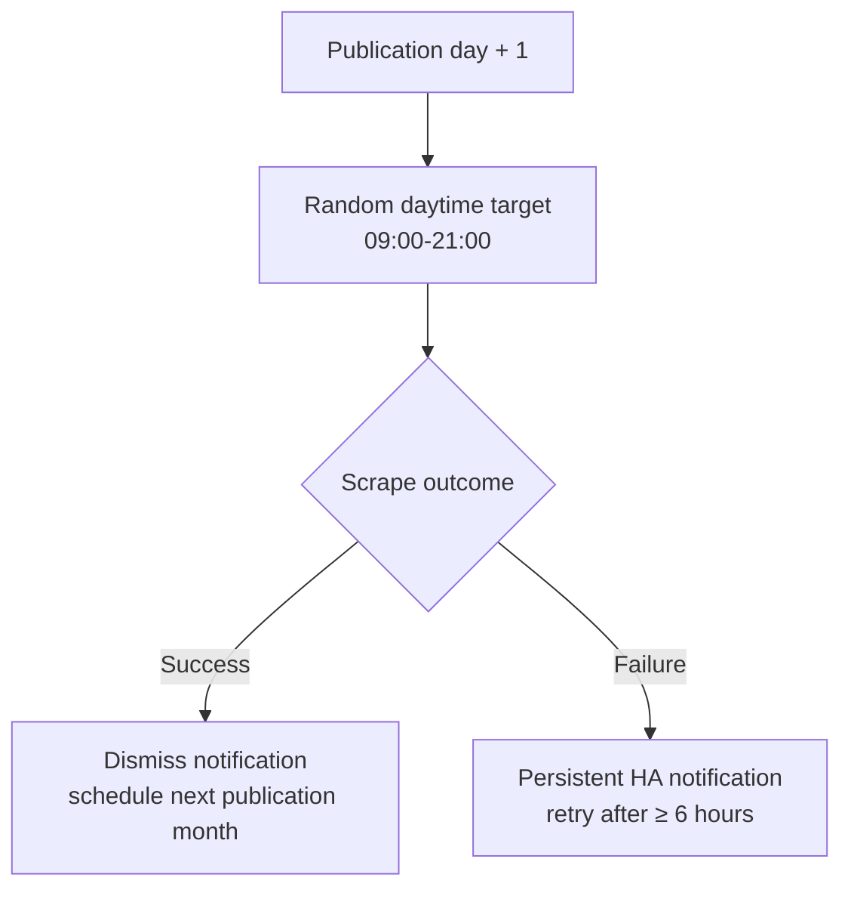

# Funda Tracker 🏠

Follow the **estimated market value** of your own home in Home Assistant, straight from your [Funda Mijn Huis](https://www.funda.nl/mijn-huis/) account.

> ### 📚 A price history that keeps growing
>
> Funda's Waardecheck shows a rolling window of the last 12 months, and older estimates drop out of it. This project imports that window once, then adds every new monthly estimate to a permanent record of its own.
>
> You start level with Funda at 12 months. From the very next month you are ahead, because you keep the estimate that just fell out of Funda's window. After five years you hold six years of history, while Funda still shows twelve months.

> ### 🕒 Built to be gentle on Funda
>
> Funda publishes a new estimate roughly once a month, so this project fetches once a month too.
>
> Each installation picks its **own random moment during the day**, so thousands of installs don't all arrive in the same minute. Retries are rate-limited as well. The goal is simple: get your data without putting load on someone else's servers.

## What it gives you

- 📈 **History that outlives Funda's.** 12 months backfilled on first run, then a permanent record that grows every month, giving you years of trend data Funda itself no longer shows.
- 💰 **Answers to money questions.** How much equity do I have? What has the house gained since I bought it? Did my renovation pay off? Fill in three amounts and the sensors appear.
- 🔔 **You hear about it when something changes.** A built-in alert if fetching ever breaks, plus a set of example automations you can adapt for value updates and your own thresholds.

## Features

| | |
|---|---|
| **Estimate + range** | Current value, upper/lower bounds, and Funda's confidence level |
| **Trends** | Monthly and yearly change in € and %, all-time high/low, price per m² |
| **Permanent history** | Funda's 12-month window imported once, then kept and extended indefinitely |
| **Resilient** | A built-in alert tells you when a fetch fails, and clears itself once it recovers |
| **Considerate** | Randomised monthly fetch time, rate-limited retries |
| **Money** | Equity, market gain, total profit, and ROI from three amounts you fill in |
| **Extras** | An [example package](#4-optional-the-example-package) with automations, plus a ready-made dashboard |

## What's in the box

This repository ships **two components** that work together:

| Component | Role |
|---|---|
| **Add-on** | Logs in to Funda, fetches the data, writes it to `/share/funda_tracker/sensors.json` |
| **Custom integration** | Reads that file and provides the sensors, the finance calculations, and the amounts you fill in |

You need **both**. The add-on alone doesn't create any entities.

## Installation

### 1. Install the add-on

[](https://my.home-assistant.io/redirect/supervisor_add_addon_repository/?repository_url=https%3A%2F%2Fgithub.com%2FRediwed%2Fha-addon-funda-tracker)

Click the badge above, or go to **Settings → Add-ons → Add-on Store → ⋮ → Repositories** and add:

```
https://github.com/Rediwed/ha-addon-funda-tracker
```

Then find **Funda Tracker** and click **Install**.

### 2. Install the custom integration

[](https://my.home-assistant.io/redirect/hacs_repository/?owner=Rediwed&repository=ha-addon-funda-tracker&category=integration)

Click the badge above to open it directly in HACS, or add this repository manually as a custom repository with category **Integration**. Without HACS, copy `custom_components/funda_tracker` to `/config/custom_components/funda_tracker`.

### 3. Restart and connect

1. Restart Home Assistant
2. Add **Funda Tracker** under **Settings → Devices & services**
3. Open the add-on's **Configuration** tab and enter your Funda email + password
4. **Start** the add-on

The add-on fetches immediately on first start, so your sensors fill up right away.

### 4. Optional: the example package

Everything above already works. `ha/packages/funda.yaml` only adds example automations, and it is a **starting point, not a finished product**. Copy it, then change what doesn't fit your setup.

1. If you don't use packages yet, enable them in `configuration.yaml`:

   ```yaml
   homeassistant:
     packages: !include_dir_named packages
   ```

2. Copy `ha/packages/funda.yaml` to `/config/packages/funda.yaml`
3. Point the automations at a specific notification service, for example `notify.mobile_app_your_phone`. They ship with `notify.notify`, which Home Assistant resolves to the first notifier it finds, so it works but may not reach the device you expect.
4. Restart Home Assistant
5. Set your alert limits under **Settings → Devices & Services → Helpers**

The package also still contains the older `input_number` helpers and template sensors. If you set those up before version 1.1.0, they keep working next to the built-in ones.

## Configuration

| Option | Description | Default |
|---|---|---|
| `funda_email` | Your Funda account email | |
| `funda_password` | Your Funda account password | |
| `schedule_day` | The day of the month Funda usually publishes new data (1–28) | `10` |

That's it. There is no time setting, on purpose.

### When does it fetch?

**The day after `schedule_day`, at a random moment between 09:00 and 21:00.**

The time is drawn once per month and remembered, so restarting doesn't reshuffle it. Times cluster around mid-afternoon but vary per installation, which spreads the load across the day instead of creating a spike on Funda's servers.

### What about restarts and failures?

| Situation | What happens |
|---|---|
| Fresh install | Fetches immediately |
| You restart the add-on | Fetches immediately (handy for debugging) |
| Restart after a **success**, within an hour | Skipped (nothing new to fetch) |
| Restart after a **failure** | Retries immediately, up to 3 times in a row |
| After that, or on a crash | Falls back to the normal retry: at least 6 hours later, within 09:00–21:00 |

<details>
<summary><strong>Upgrading from 1.0.1 or earlier?</strong></summary>

The old `schedule_hour` option is still accepted but ignored, because fetch times are randomised now. Home Assistant asks you to confirm this update manually, because:

- `schedule_day` now means *Funda's publication day*, and the fetch happens the day after
- Dashboards, templates, and automations must use the `sensor.funda_tracker_*` entities

</details>

## Entities

### Sensors (provided by the custom integration)

| Entity | Description |
|---|---|
| `sensor.funda_tracker_woningwaarde` | Current estimated value with all data as attributes |
| `sensor.funda_tracker_ondergrens` | Lower bound of estimate range |
| `sensor.funda_tracker_bovengrens` | Upper bound of estimate range |
| `sensor.funda_tracker_maandwijziging` | Monthly change in € |
| `sensor.funda_tracker_maandwijziging_2` | Monthly change in % |
| `sensor.funda_tracker_jaarwijziging` | Year-over-year change in € |
| `sensor.funda_tracker_jaarwijziging_2` | Year-over-year change in % |
| `sensor.funda_tracker_all_time_high` | Highest recorded value |
| `sensor.funda_tracker_all_time_low` | Lowest recorded value |
| `sensor.funda_tracker_betrouwbaarheid` | Confidence level (High/Medium/Low) |
| `sensor.funda_tracker_prijs_per_m2` | Value per square meter |
| `sensor.funda_tracker_delta_status` | Monthly delta percentage + direction |

The main `sensor.funda_tracker_woningwaarde` entity keeps its last valid value when a fetch fails, so your history has no gaps. Two attributes tell you how fresh it is:

- `last_successful_update`: when fresh data last arrived
- `update_overdue`: becomes `true` after 35 days without new data

### Finance sensors

Fill in the amounts below and these appear automatically. No helpers to create.

| Entity | Description |
|---|---|
| `sensor.funda_tracker_overwaarde` | Equity (value minus mortgage) |
| `sensor.funda_tracker_marktwinst` | Market gain (value minus purchase price) |
| `sensor.funda_tracker_markt_roi` | Market ROI since purchase (%) |
| `sensor.funda_tracker_totale_winst` | Total profit (value minus total investment) |
| `sensor.funda_tracker_totale_roi` | Total ROI including renovations (%) |

Each one stays unavailable until its matching amount is above 0.

### Amounts you fill in

These are `number` entities on the Funda Tracker device. Set them in the UI, or from an automation.

| Entity | Description |
|---|---|
| `number.funda_tracker_aankoopprijs` | The price you paid (koopsom), enables market gain and ROI |
| `number.funda_tracker_totale_investering` | Purchase plus renovation, loans, and cash, enables total profit and ROI |
| `number.funda_tracker_hypotheek` | Outstanding mortgage balance, enables equity |

Because they are real entities, an automation can maintain them. For example, to pay off the mortgage monthly:

```yaml
actions:
  - action: number.set_value
    target:
      entity_id: number.funda_tracker_hypotheek
    data:
      value: "{{ states('number.funda_tracker_hypotheek') | int - 850 }}"
```

> **Example:** You bought a house for €350k, then spent €100k renovation (mortgage), €20k green loan, and €30k cash. Set **Aankoopprijs** to 350000 and **Totale investering** to 500000. At a current value of €475k: market ROI is +35.7%, total ROI is -5.0%.

## Notifications

Only one notification is built in. The rest are examples you copy and adapt.

| | Built in | Example automation |
|---|---|---|
| **Fetching failed** | ✅ Shown in the Home Assistant notification panel | |
| **Value updated** | | 📝 Push |
| **Value crossed your high/low limit** | | 📝 Push |
| **Value moved more than 2% in a month** | | 📝 Push |
| **Yearly summary on 1 January** | | 📝 Push |

The failure alert lives in the add-on because it has to work for everyone, including people who never configured a notification service. It uses a fixed notification ID, so retries update the same message instead of stacking up, and it clears itself after a successful fetch.

The others are ordinary Home Assistant automations shipped in the [example package](#4-optional-the-example-package). They use `notify.notify` and plain thresholds, so treat them as a template: `notify.notify` resolves to the first notification service Home Assistant finds, so point it at the one you actually want and adjust the wording and limits to taste.

## Dashboard

A ready-to-use dashboard is included in this repo. Copy the YAML from GitHub:

👉 **[funda-dashboard.yaml](https://github.com/Rediwed/ha-addon-funda-tracker/blob/main/ha/dashboard/funda-dashboard.yaml)**

### Prerequisites

Install [apexcharts-card](https://github.com/RomRider/apexcharts-card) from HACS for the history graph:
1. Go to **HACS → Frontend → Search "apexcharts-card" → Install**
2. Restart HA

### Option A: Add as a new dashboard

1. Go to **Settings → Dashboards → Add Dashboard**
2. Choose **"New dashboard from scratch"**
3. Give it a name (e.g. "Funda") and click **Create**
4. Open the new dashboard → click **⋮ → Edit Dashboard → ⋮ → Raw configuration editor**
5. Paste the contents of `ha/dashboard/funda-dashboard.yaml`
6. Click **Save**

### Option B: Add cards to an existing dashboard

1. Open your dashboard → click **⋮ → Edit Dashboard → + Add Card**
2. Choose **Manual** (YAML) at the bottom
3. Copy individual cards from `ha/dashboard/funda-dashboard.yaml` and paste them one by one

## How it works

The add-on signs in to Funda using its regular OIDC + PKCE login flow, then calls the same Waardecheck API the website uses. It uses `curl_cffi` to present a normal Chrome TLS fingerprint, because Funda blocks default Python HTTP clients.

Authentication requests are restricted to Funda's own HTTPS hosts, and redirects that would forward your credentials elsewhere are refused.

### Data flow



### Scheduling and retries



## Troubleshooting

- **Login fails**: Check credentials and the first failing step in the add-on Log tab
- **No fresh data**: A failed scrape creates a persistent HA notification and retries after at least 6 hours within 09:00–21:00
- **Retry while debugging**: Restart the add-on to run one immediate retry while a failure is pending; this works up to 3 restarts in a row before falling back to the normal six-hour retry
- **Old `sensor.funda_*` entities unavailable**: Migrate dashboards, templates, and automations to `sensor.funda_tracker_*`
- **Stale-data warning**: The integration has not received a valid shared data file for more than 35 days
- **Entity remains available after failure**: The last valid valuation stays visible; inspect `last_successful_update` and `update_overdue` on the main entity
- **Profit/ROI empty**: Set your purchase price in Settings → Helpers → Funda Aankoopprijs
- **No history graph**: Install apexcharts-card from HACS
